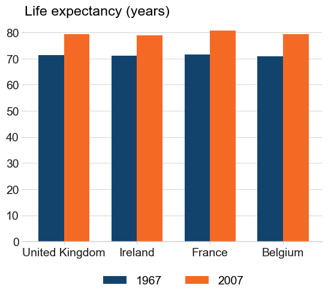
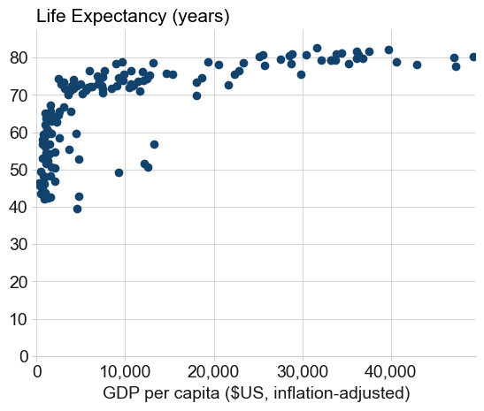
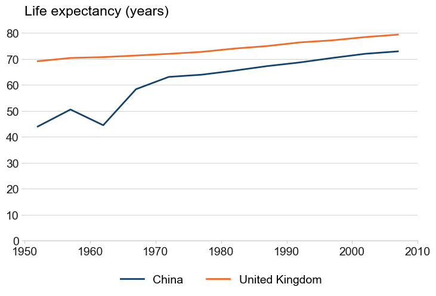
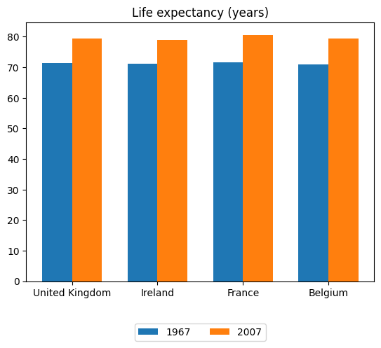
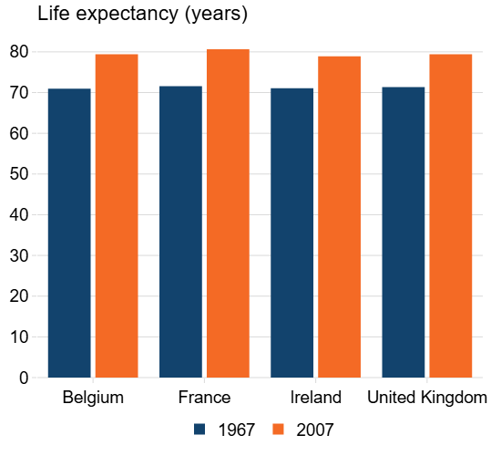
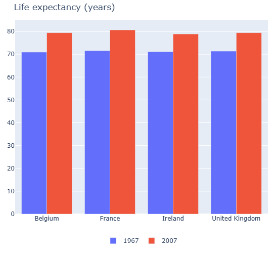

# afcharts-py 

## Overview

The afcharts-py python package helps make accessible Matplotlib and Plotly charts following [Government Analysis Function Data Visualisation guidance](https://analysisfunction.civilservice.gov.uk/policy-store/data-visualisation-charts/):

- **Automatic chart formatting** with pre-built style sheets for Matplotlib and Plotly.
- **Chart colours** from the Analysis Function [accessible colour palettes](https://analysisfunction.civilservice.gov.uk/policy-store/data-visualisation-colours-in-charts/#section-4).
- **Example code** for common chart types, such as line charts, bar charts, scatterplots and small multiples.

  

## Installation

```bash
pip install afcharts-py
```

## Usage

Analysis Function **formatting** can be applied to any Matplotlib or Plotly chart using the built-in style sheets. afcharts-py also provides easy access to the Analysis Function recommended **colour palettes**.

See the [afcharts-py cookbook](https://best-practice-and-impact.github.io/afcharts-py/) for a Getting Started guide and extensive code examples for common chart types.

### Matplotlib

```python
import matplotlib.pyplot as plt

# Apply the afcharts style to all Matplotlib plots
plt.style.use('afcharts.afcharts')
```

Example: A [Matplotlib bar chart](https://best-practice-and-impact.github.io/afcharts-py/01-matplotlib-usage.html#grouped-bar-chart) with afcharts (left) and without (right)

 

<!-- | Matplotlib + afcharts | Default Matplotlib |
|:---------------:|:------------------:|
|  |  | -->

### Plotly

```python
from afcharts.pio_template import pio

# Apply the afcharts style to all Plotly plots
pio.templates.default = "theme_af"
```

Example: A [Plotly bar chart](https://best-practice-and-impact.github.io/afcharts-py/03-plotly-usage.html#grouped-bar-chart), with afcharts (left) and without (right)

 

### Colours

Easily return a list of colours from the Analysis Function [accessible colour palettes](https://analysisfunction.civilservice.gov.uk/policy-store/data-visualisation-colours-in-charts/#section-4) with the `af_colours()` function:

```python
from py_af_colours import af_colours

# Get the duo colour palette hex codes
duo = af_colours("duo")

# Get a five colour categorical palette as rgb codes
cat5 = af_colours("categorical", "rgb", 5)
```

## Getting help
If you encounter a bug, please file a minimal reproducible example on [Github Issues](https://github.com/best-practice-and-impact/afcharts-py/issues). For questions and other discussion, please start a [discussion](https://github.com/best-practice-and-impact/afcharts-py/discussions).

## Contributing
Interested in contributing? Check out the [contributing guidelines](CONTRIBUTING.md). 

## Acknowledgments
The afcharts-py package is based on the
[afcharts](https://github.com/best-practice-and-impact/afcharts.git) R package and the [py-af-colours](https://github.com/best-practice-and-impact/py-af-colours) package.

## License
Unless stated otherwise, the codebase is released under [the MIT License](LICENSE.md). This covers both the codebase and any sample code in the documentation.

The documentation is [© Crown copyright](https://www.nationalarchives.gov.uk/information-management/re-using-public-sector-information/uk-government-licensing-framework/crown-copyright/) and available under the terms of the [Open Government 3.0](https://www.nationalarchives.gov.uk/doc/open-government-licence/version/3/) licence.