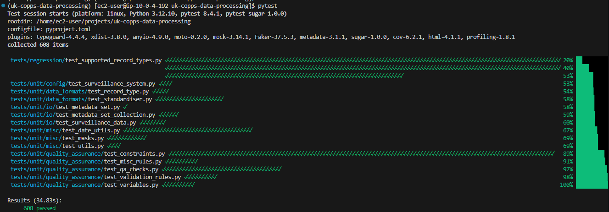
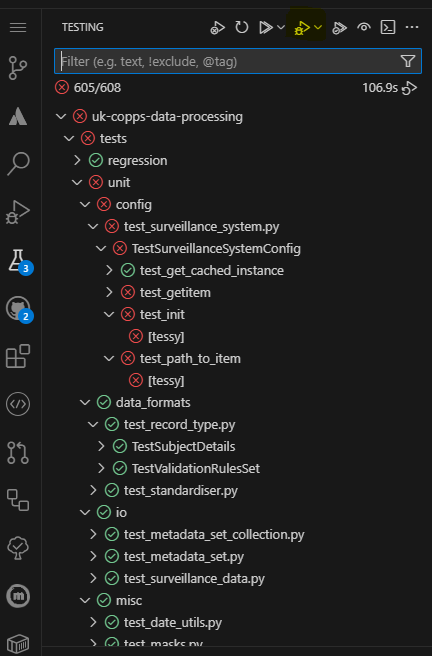

# Introduction to `pytest`

RealPython.org offers great resources on almost any python topic, `pytest` being no exception.Their article [Effective Python Testing With pytest](https://realpython.com/pytest-python-testing/) is a great introduction to `pytest`. The official [pytest docs](https://docs.pytest.org/en/stable/getting-started.html) are also good and definitely worth looking at for details of specific features.

Pytest makes extensive use of python `@decorator`s, so if you're unfamiliar with these, the Real Python [Primer on Python Decorators](https://realpython.com/primer-on-python-decorators/) on these is very helpful.

## Installation

Installing the `afcharts` package with with `uv sync` or `pip install -e .[dev,test,docs]` will install `pytest` along with some plugins via the `test` dependency group.

For a manual install you can do:
```bash
pip install pytest
```

Pytest can be configured via a `[pytest]` section in `pyproject.toml`, but generally the default settings are fine.

### `pytest` plugins

#### Matplotlib
Pytest also has a powerful plugin system that enables customisation and integration with different python packages. For `afcharts` plugins like [pytest-mpl](https://pytest-mpl.readthedocs.io/en/stable/usage.html) are incredibly useful for easily implementing regression tests to check that the output image of a plot matches a set of stored baseline images, helping to identify the discrepancies when they occur.
Matplotlib also has some built-in [pytest functionality](https://github.com/matplotlib/matplotlib/blob/b132b5bd1289b97d3f81d015ee2a4ba8e5e9ea0b/doc/devel/testing.rst#writing-an-image-comparison-test), which may be useful in some cases.


#### Plotly
I'm not aware of a plotly plugin, but similar functionality looks possible with [this recipe](https://www.stefsmeets.nl/posts/plotly_pytest/).

#### Other examples
Here are some examples of useful plugins. Often these have settings that can be configured through your `pyproject.toml`. If these packages are included in the `pyproject.toml` `dev` dependency-group then they'll also automatically be installed with a `uv sync`.
```bash
pip install pytest-mpl  # matplotlib regression test plugin
pip install pytest-sugar  # plugin for prettier terminal output with green ticks
pip install pytest-cov  # plugin for seeing how much of your codebase is covered by tests
pip install pytest-mock  # plugin for object "mocking"
...
```

## Running tests

See [pytest docs](https://docs.pytest.org/en/7.1.x/explanation/goodpractices.html)

`pytest` automatically finds appropriately named tests, so you can run your whole test suite simply with:
```bash
pytest
```
This should produce output like this (with the `pytest-sugar` plugin installed):

where each green tick represents a test that has passed.

You can filter which tests are run using the `-k` flag:
```bash
pytest -k test_helper1
```

## Test discovery

The two main approaches to structuring tests are:
1. In a tests directory mirroring the package structure:
   ```shell
    ├─── package
    │   ├─── module_1.py                    # The actual codebase
    │   ├─── module_2.py                    # The actual codebase
    ├─── tests
    │   ├─── conftest.py                    # Optional configuration of all tests in this directory
    │   ├─── test_module_1.py               # Tests for the functionality in module.py
    │   ├─── test_module_2.py               # Tests for the functionality in module.py
    ```
2. Alongside the code
    ```shell
    ├─── sub_package
    │   ├─── module.py                    # The actual codebase
    │   ├─── test_module.py               # Tests for the functionality in module.py
    ```

Typically approach 1 is most widely followed with the test sub-folder and filename structure mirroring the structure of the package.

`pytest` will automatically detect tests within python files named `test_*.py` or `*_test.py`, collecting test items that are:
- `test` prefixed test functions or methods outside of class
- `test` prefixed test functions or methods inside `Test` prefixed test classes


## Example test file
Parametrisation of tests is very useful and allows you test test many scenarios with one test function/class (see [Real Python article](https://realpython.com/pytest-python-testing/#parametrization-combining-tests)).

```python
# test_helper_functions.py

import pytest

# Import functionality to be tested
from afcharts.helper_functions import helper1, helper2


@pytest.fixture
def my_dataset():
    # Read my data and cache it so it can be reused for lots of tests
    return my_data

@pytest.fixture
def my_modfied_dataset(my_dataset):
    # Fixtures can use other fixtures as inputs to combine and modify resources in various ways
    return modified_data

# Parametrise the test function with multiple test cases
@pytest.mark.parametrize(
    argnames=(
        'input_kwargs',
        'result_expected',
    ),
    argvalues=[
        pytest.param(
            {'arg1': 'value', 'arg2': 2},
            'expected_output',
            id='informative_name_for_test_case_1',
        ),
        pytest.param(
            {'arg1': 'value3', 'arg2': 4},
            'expected_output_2',
            id='informative_name_for_test_case_2',
        ),
    ],
)
# Note test functions must begin or end with "test"
def test_helper_function_1(input_kwargs, result_expected, my_dataset):
    # Call the functionality under test
    result = helper1(**input_kwargs)

    # Check the output is as expected
    assert result == result_expected


# Note test classes must begin or end with "Test"
class TestHelperFunction2:
    # Parametrise the test function with multiple test cases
    @pytest.mark.parametrize(
        argnames=(
            'input_kwargs',
            'result_expected',
        ),
        argvalues=[
            pytest.param(
                {'arg1': 'value', 'arg2': 2},
                'expected_output',
                id='informative_name_for_test_case_1',
            ),
            pytest.param(
                {'arg1': 'value3', 'arg2': 4},
                'expected_output_2',
                id='informative_name_for_test_case_2',
            ),
        ],
    )
    def test_behaviour1():
        # do something
        # assert something

    def test_behaviour2():
        # do something
        # assert something
```

## VSCode integration

The VSCode python test explorer functionality is very useful for navigating, running and debugging tests. Placing breakpoints in your code and pressing the highlighted debug button in the image below alows you to debug your test functions easily.


## Types of testing
`pytest` can be used to integrate a range of different types of tests: unit tests, integration tests, system tests, regression tests etc.

### Unit tests
Unit tests are intended to test as small, idependent a *unit* of functionality as possible, so that a failing test narrows down the error to as small a part of the codebase as possible. Therefore, a unit test will typically test one function/method at a time and avoid dependencies/couplings on other parts of the codebase.

### Integration tests
Integration tests tie together functionality as it's intended to be used, to ensure the integrated system operates as intended.


## Further reading
- `fixtures` are very powerful for setting up shared resources to reuse across tests. They can seem a little strange at first so it's worth looking at the [official docs](https://docs.pytest.org/en/stable/how-to/fixtures.html) after the [Real Python intro](https://realpython.com/pytest-python-testing/#fixtures-managing-state-and-dependencies). Benefits include:
  - Efficient caching of data and objects for faster tests
  - Robust caching of inputs so each test gets a "fresh" example
  - Clever dependency resolution to only run the fixtures at are needed for the tests being run
- `marks` can be used to label tests in order to selectively group and filter certain types of tests e.g. "slow", 
  - These allow you to easily configure customisable "test suits" for different purposes
- `conftest.py` files allow you to share fixtures and configuration across all test files in a directory.
  - e.g. If all your tests use the same dataset, putting the fixture in conftest.py can make it globally available to all your test functions as an argument.
- "`Mock`ing" objects allows you run tests without access to infrastructure (e.g. a database or AWS resources) or to decouple your code from other dependencies.
- Useful command line arguments:
  - `pytest --lf` only re-run tests that have failed